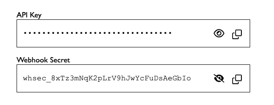

# Secret Text
[](https://github.com/nichoth/secret-text/actions/workflows/nodejs.yml)
[](README.md)
[](README.md)
[](https://packagephobia.com/result?p=@nichoth/secret-text)
[](https://bundlephobia.com/package/@substrate-system/secret-text)
[](https://semver.org/)
[](./CHANGELOG.md)
[](LICENSE)


Web component for secrets. Has a copy button and visiblity icon button.



[See a live demo](https://nichoth.github.io/secret-text/)

<details><summary><h2>Contents</h2></summary>

<!-- toc -->

- [Install](#install)
- [Example](#example)
- [API](#api)
  * [ESM](#esm)
  * [Common JS](#common-js)
  * [Attributes](#attributes)
  * [Events](#events)
- [CSS](#css)
  * [Import CSS](#import-css)
  * [Customize CSS via variables](#customize-css-via-variables)
- [Use](#use)
  * [JS](#js)
  * [HTML](#html)
  * [pre-built](#pre-built)

<!-- tocstop -->

</details>

## Install

```sh
npm i -S @substrate-system/secret-text
```

## Example

```ts
import { SecretText } from '@substrate-system/secret-text'
import '@substrate-system/secret-text/css'

document.body.innerHTML += `
    <div style="padding: 2rem; max-width: 480px;">
        <span>API Key</span>
        <${SecretText.TAG} value="sk-proj-abc123def456ghi789jklmno">
        </${SecretText.TAG}>

        <span>Webhook Secret</span>
        <secret-text
            value="whsec_8xTz3mNqK2pLrV9hJwYcFuDsAeGbIo"
            visible
        ></secret-text>
    </div>
`
```

## API

This exposes ESM and common JS via
[package.json `exports` field](https://nodejs.org/api/packages.html#exports).

### ESM
```js
import '@substrate-system/secret-text'
```

### Common JS
```js
require('@substrate-system/secret-text')
```

### Attributes

| Attribute | Type | Description |
|-----------|------|-------------|
| `value` | `string` | The secret text to display or mask |
| `visible` | `boolean` | If present, the secret is shown in plain text; if absent, it is masked with bullets |

### Events

| Event | Detail | Description |
|-------|--------|-------------|
| `secret-text:copy` | `{ value: string }` | Fired when the copy button is clicked |
| `secret-text:show` | `{ isVisible: boolean }` | Fired when the secret is revealed |
| `secret-text:hide` | `{ isVisible: boolean }` | Fired when the secret is hidden |

```ts
document.querySelector('secret-text')
    .addEventListener('secret-text:show', (ev) => {
        console.log(ev.detail.isVisible)  // true
    })

// or use the `.on` method:

document.querySelector('secret-text').on('show', ev => {
    console.log(ev.detail.isVisible)  // true
})
```


## CSS

### Import CSS

```js
import '@substrate-system/secret-text/css'
```

Or minified:
```js
import '@substrate-system/secret-text/min/css'
```

### Customize CSS via variables

| Variable | Default | Description |
|----------|---------|-------------|
| `--st-bg` | `#fff` | Background color of the component |
| `--st-border` | `#1a1a1a` | Border color |
| `--st-radius` | `0` | Border radius |
| `--st-text` | `#1a1a1a` | Text color |
| `--st-btn` | `#8a8a8a` | Eye button icon color |
| `--st-btn-hover` | `#1a1a1a` | Eye button icon color on hover |
| `--st-btn-hover-bg` | `rgb(0 0 0 / 5%)` | Eye button background color on hover |
| `--st-focus` | `#2563eb` | Focus outline color |
| `--st-font` | `'Courier New', 'Courier', monospace` | Font family for the secret text |

```css
secret-text {
    --st-bg: #f9fafb;
    --st-border: #d1d5db;
    --st-radius: 6px;
    --st-focus: #7c3aed;
}
```

## Use
This calls the global function `customElements.define`. Just import, then use
the tag in your HTML.

### JS
```js
import '@substrate-system/secret-text'
```

### HTML
```html
<div>
    <secret-text></secret-text>
</div>
```

### pre-built

This package exposes minified JS and CSS files too. Copy them to a location that is
accessible to your web server, then link to them in HTML.

#### copy
```sh
cp ./node_modules/@substrate-system/secret-text/dist/index.min.js ./public/secret-text.min.js
cp ./node_modules/@substrate-system/secret-text/dist/style.min.css ./public/secret-text.css
```

#### HTML
```html
<head>
    <link rel="stylesheet" href="./secret-text.css">
</head>
<body>
    <!-- ... -->
    <script type="module" src="./secret-text.min.js"></script>
</body>
```
